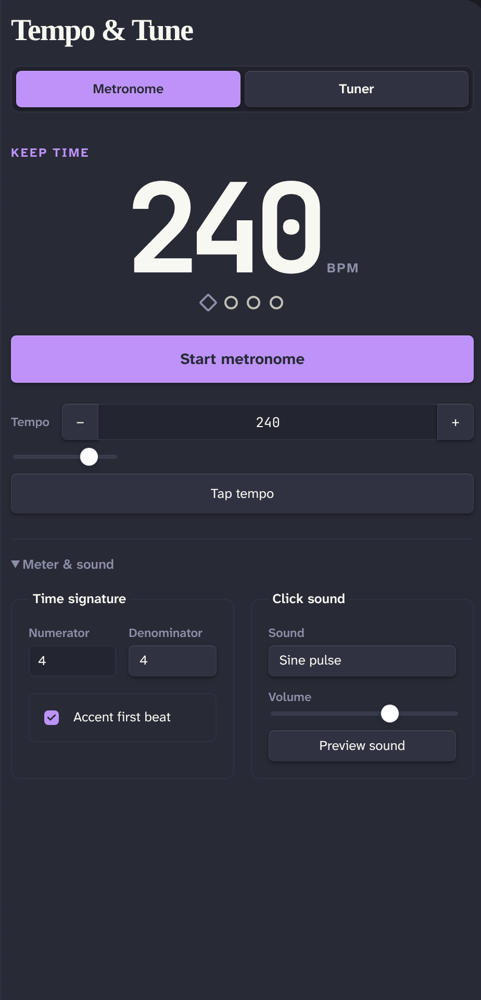

# Metronome + Tuner

Metronome + Tuner adds timing and chromatic tuning tools to Obsidian.



## Features

- Metronome from 30 to 300 BPM with **Tap tempo**, configurable time signature, first-beat accent, volume, and seven click sounds
- Chromatic tuner with frequency, confidence, cents, and note readouts
- Configurable A4 reference from 415 to 466 Hz
- Keyboard-accessible tabs and controls
- Desktop and mobile support

## Privacy

The plugin requests microphone access only after you select **Use microphone**. It analyzes microphone audio locally and does not record, store, transmit, or play that audio. Microphone permission and availability depend on the device, operating system, and Obsidian mobile platform.

## Install

After the plugin is accepted into the Obsidian marketplace:

1. Open **Settings → Community plugins** in Obsidian.
2. Select **Browse**, search for **Metronome + Tuner**, and select **Install**.
3. Select **Enable**.

### Manual install

Download `main.js`, `manifest.json`, and `styles.css` from a release. Copy them into:

```text
<vault>/.obsidian/plugins/metronome-tuner/
```

Restart Obsidian, then enable **Metronome + Tuner** under **Settings → Community plugins**.

## Usage

Select the ribbon icon or run **Open** to open the **Tempo & tune** view.

- In **Metronome**, set the tempo, select **Tap tempo**, configure **Meter & sound**, then select **Start metronome**. Press Space while focus is outside a control to start or stop playback.
- In **Tuner**, select **Use microphone**, allow microphone access, and play one clear note near the microphone. Select **Stop listening** when finished.
- Change startup defaults under **Settings → Metronome + Tuner**.

## Commands

- **Open**
- **Start metronome**
- **Stop metronome**

## Development

Node.js 24 or later is required.

```bash
npm install
npm run dev
```

`npm run dev` watches the source and writes `main.js` at the repository root.

## Validation

```bash
npm run lint
npm test
npm run typecheck
npm run build
npm run build:clean
npm run check
npm run verify:release
```

`npm run build` writes a production `main.js`. `npm run build:clean` removes any existing `main.js` first. `npm run check` runs linting, tests, type checking, and a clean production build. `npm run verify:release` is the release gate: it runs `check`, then validates release metadata and the newly built artifacts. Pass a tag to check it locally, for example `npm run verify:release -- 1.0.0`.

## Release process

1. Set the same strict `x.y.z` version in `package.json`, `manifest.json`, and `versions.json`.
2. Run `npm run verify:release -- x.y.z`.
3. Create and push an exact `x.y.z` tag. Do not add a `v` prefix.
4. CI creates or updates a **draft** GitHub release. Review its assets and notes, then publish it manually.

Do not publish a generated draft without manual verification.

## Support and issues

Created by [Patrick Fanella](https://patrickfanella.co). Find more work at [Subcult](https://subcult.tv) and [GitHub](https://github.com/patrickfanella). Support is available through Obsidian's native funding link.

Questions or feedback? Email [patrick@subcult.tv](mailto:patrick@subcult.tv). Report bugs or request features in [GitHub Issues](https://github.com/patrickfanella/obsidian-plugin-metronome-tuner/issues).
